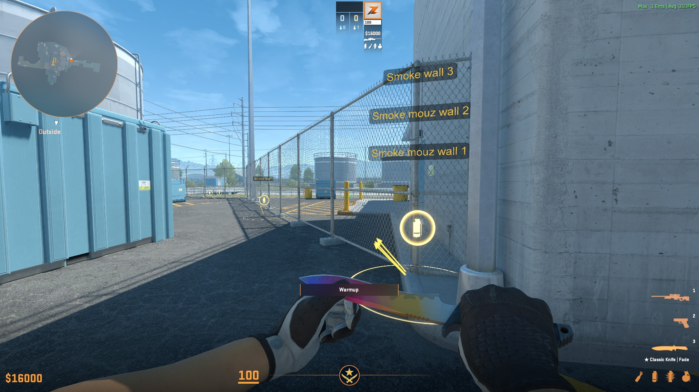
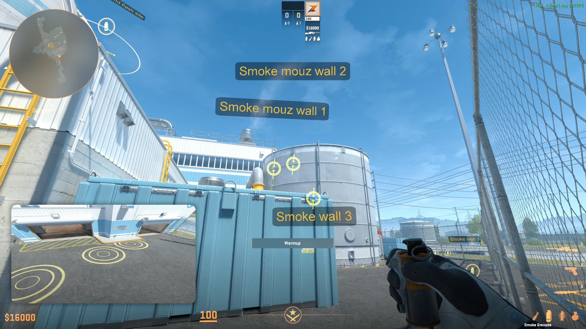

# CS2-Annotations

<!-- ALL-CONTRIBUTORS-BADGE:START - Do not remove or modify this section -->

<!-- ALL-CONTRIBUTORS-BADGE:END -->

This repository contains curated utility lineups for Counter-Strike 2, using the built-in annotations feature.
The lineups are designed to help players learn and practice utility lineups, and can be accessed by subscribing to the
[Steam workshop collection](https://steamcommunity.com/sharedfiles/filedetails/?id=3397847952)

|                                                     |                                                |
| --------------------------------------------------- | ---------------------------------------------- |
|  |  |

## Usage

1. Go to [the Steam workshop page](https://steamcommunity.com/sharedfiles/filedetails/?id=3397847952) and click
   "Subscribe to all". This will download the annotations to your game. Any updates to the annotations will be
   automatically downloaded.
2. Start the game, select __practice__ and __competitive__ in the top menu, choose a map, enable 'Load Map Guide' on the
   left, select the map guide from the dropdown, and click 'Go'. The annotations will be loaded and displayed in-game.

## Contributing

See [CONTRIBUTING.md](CONTRIBUTING.md) for more information on how to contribute.

## Contributors

<!-- spell-checker:disable -->
<!-- markdown-link-check-disable -->
<!-- ALL-CONTRIBUTORS-LIST:START - Do not remove or modify this section -->
<!-- prettier-ignore-start -->
<!-- markdownlint-disable -->
<table>
  <tbody>
    <tr>
      <td align="center" valign="top" width="14.28%"><a href="https://github.com/ReneRebsdorf"> <b>Rene Rebsdorf</b></a> <a href="https://github.com/ReneRebsdorf/CS2-annotations/commits?author=ReneRebsdorf" title="Code">💻</a> <a href="#design-ReneRebsdorf" title="Design">🎨</a> <a href="#content-ReneRebsdorf" title="Content">🖋</a> <a href="https://github.com/ReneRebsdorf/CS2-annotations/commits?author=ReneRebsdorf" title="Documentation">📖</a> <a href="#ideas-ReneRebsdorf" title="Ideas, Planning, & Feedback">🤔</a> <a href="#infra-ReneRebsdorf" title="Infrastructure (Hosting, Build-Tools, etc)">🚇</a> <a href="#maintenance-ReneRebsdorf" title="Maintenance">🚧</a></td>
      <td align="center" valign="top" width="14.28%"><a href="https://github.com/Staalet"> <b>Thomas Staal</b></a> <a href="#infra-Staalet" title="Infrastructure (Hosting, Build-Tools, etc)">🚇</a></td>
      <td align="center" valign="top" width="14.28%"><a href="https://github.com/JanElholm"> <b>Jan Elholm</b></a> <a href="https://github.com/ReneRebsdorf/CS2-annotations/commits?author=JanElholm" title="Tests">⚠️</a></td>
      <td align="center" valign="top" width="14.28%"><a href="https://github.com/EMRandall13"> <b>EMRandall13</b></a> <a href="#design-EMRandall13" title="Design">🎨</a> <a href="#ideas-EMRandall13" title="Ideas, Planning, & Feedback">🤔</a> <a href="#content-EMRandall13" title="Content">🖋</a></td>
      <td align="center" valign="top" width="14.28%"><a href="https://github.com/MrGronning"> <b>Andreas</b></a> <a href="#data-MrGronning" title="Data">🔣</a></td>
      <td align="center" valign="top" width="14.28%"><a href="https://github.com/Friiiis"> <b>Gustav Friis-Hansen</b></a> <a href="#data-Friiiis" title="Data">🔣</a></td>
      <td align="center" valign="top" width="14.28%"><a href="https://github.com/EstevaoCalera"> <b>Estêvão Calera</b></a> <a href="https://github.com/ReneRebsdorf/CS2-annotations/commits?author=EstevaoCalera" title="Code">💻</a></td>
    </tr>
  </tbody>
</table>

<!-- markdownlint-restore -->
<!-- prettier-ignore-end -->

<!-- ALL-CONTRIBUTORS-LIST:END -->
<!-- markdown-link-check-enable -->
<!-- spell-checker:enable -->

## License

[MIT](LICENSE)
